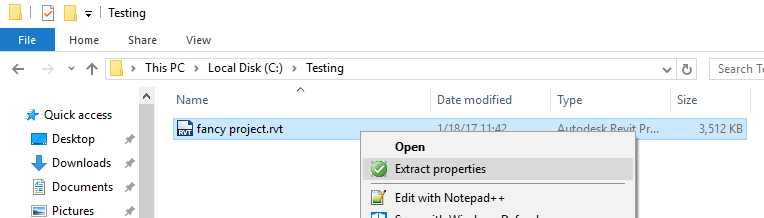

# model.derivative-csharp-context.menu


[](https://asp.net/)
[](http://opensource.org/licenses/MIT)

[](http://developer.autodesk.com/)


# Description

This sample will add a Windows Explorer context menu "Extract Properties" for Revit files, which uploads the file to Forge, extract all properties and generates a Excel (XLS) file at the same folder as the original RVT file. 



It includes 3 projects: 

**1. CSShellExtContextMenuHandler**: Class Library (.DLL) that implement the required COM interface to extend the Windows Explorer context menu. The original source code is available at this [Code Project article](https://www.codeproject.com/articles/174369/how-to-write-windows-shell-extension-with-net-lang).

**2. Translator**: WinForm .EXE that contains a basic interface and handles upload of the Revit files, download of Excel results and notifications during the process.

**3. TranslatorServer**: ASP.NET project that handles all Forge related tasks, hiding those operations from the end-user. Forge Client ID & Secret are used here.

## Thumbnail

After registering the DLL, the new option should appear on the Windows Explorer right-click context menu. During the processing, a notification ballon indicate the overall process. When ready, the Excel file will be downloaded to the same folder as the original Revit file.


# Security

Your Forge Client ID & Secret **should never** be exposed or embedded on a desktop application, it is never safe. Your write-enabled token should also not be send to a desktop application. There are several articles about that available on the web.

This sample keeps all Forge related information on the **TranslationServer** and only send a random GUID to the desktop application (**Transaltor.exe**) that allow access to the resulting Excel and expires after 24 hours (same as [Transient Bucket retention policy](https://developer.autodesk.com/en/docs/data/v2/overview/retention-policy/)). The desktop app keeps this GUID in memory and use it to request the status (progress) and download the Excel file when it's done.

# Setup

## Prerequisites

1. **Forge Account**: Learn how to create a Forge Account, activate subscription and create an app at [this tutorial](http://learnforge.autodesk.io/#/account/). 
2. **Visual Studio**: Either Community (Windows) or Code (Windows, MacOS).
3. **.NET** basic knowledge with C#

## Running Locally

Clone this project or download it. It's recommended to install [GitHub desktop](https://desktop.github.com/). To clone it via command line, use the following (**Git Shell** on Windows):

    git clone https://github.com/autodesk-forge/model.derivative-csharp-context.menu

For using this sample, you need an Autodesk developer credentials. Visit the [Forge Developer Portal](https://developer.autodesk.com), sign up for an account, then [create an app](https://developer.autodesk.com/myapps/create) that uses Data Management and Model Derivative APIs. For this new app, use **http://localhost:3000/api/forge/callback/oauth** as Callback URL, although is not used on 2-legged flow. Finally take note of the **Client ID** and **Client Secret**.

At the **TranslatorServer** project, open the **web.config** file and adjust the appSettings (for deployment, use host settings instead):

```xml
<appSettings>
   <add key="FORGE_CLIENT_ID" value="<<Your Client ID from Developer Portal>>" />
   <add key="FORGE_CLIENT_SECRET" value="<<Your Client Secret>>" />
</appSettings>
```

Compile the solution, Visual Studio should download the NUGET packages ([Autodesk Forge](https://www.nuget.org/packages/Autodesk.Forge/), [RestSharp](https://www.nuget.org/packages/RestSharp) and [Newtonsoft.Json](https://www.nuget.org/packages/newtonsoft.json/))

The CSShellExtContextMenuHandler.dll must be registered with Admin level permissions on the local machine:

    regasm.exe CSShellExtContextMenuHandler.dll /codebase

Run should start the **TranslatorServer** web app.

Right-click on a .RVT file and select the "Extract Properties" menu option, it should trigger the "Translator.exe" on the same folder as the DLL. 

[This video](https://www.youtube.com/watch?v=Vu8yAhmZUb0) demonstrates how to run it locally. 

# Deployment

The **TranslatorServer** should be deployed to a ASP.NET compatible host, like Azure or Appharbor. For Appharbor deployment, following [this steps to configure your Forge Client ID & Secret](http://adndevblog.typepad.com/cloud_and_mobile/2017/01/deploying-forge-aspnet-samples-to-appharbor.html).

Adjust the **Translator** desktop app app.config with the server address:

```xml
<appSettings>
   <add key="TranslatorServer" value="https://YOUR_DOMAIN_NAME.COM"/>
</appSettings>
```

# Further Reading

Documentation:

- [Model Derivative API](https://forge.autodesk.com/en/docs/model-derivative/v2/developers_guide/overview/)

Other samples:

- BIM 360 XLS [live](https://bim360xls.autodesk.io/) and [source code](https://github.com/Autodesk-Forge/bim360appstore-model.derivative-nodejs-xls.exporter)

### Troubleshooting

- Nothing happens after click on context menu "Extract Properties": make sure the path of the `Translator.exe` is correct at the [Context Menu class](CSShellExtContextMenuHandler/FileContextMenuExt.cs#L65). You may need to unregister the DLL to fix it. 

## License

This sample is licensed under the terms of the [MIT License](http://opensource.org/licenses/MIT).
Please see the [LICENSE](LICENSE) file for full details.

## Written by

Augusto Goncalves [@augustomaia](https://twitter.com/augustomaia), [Forge Partner Development](http://forge.autodesk.com)
